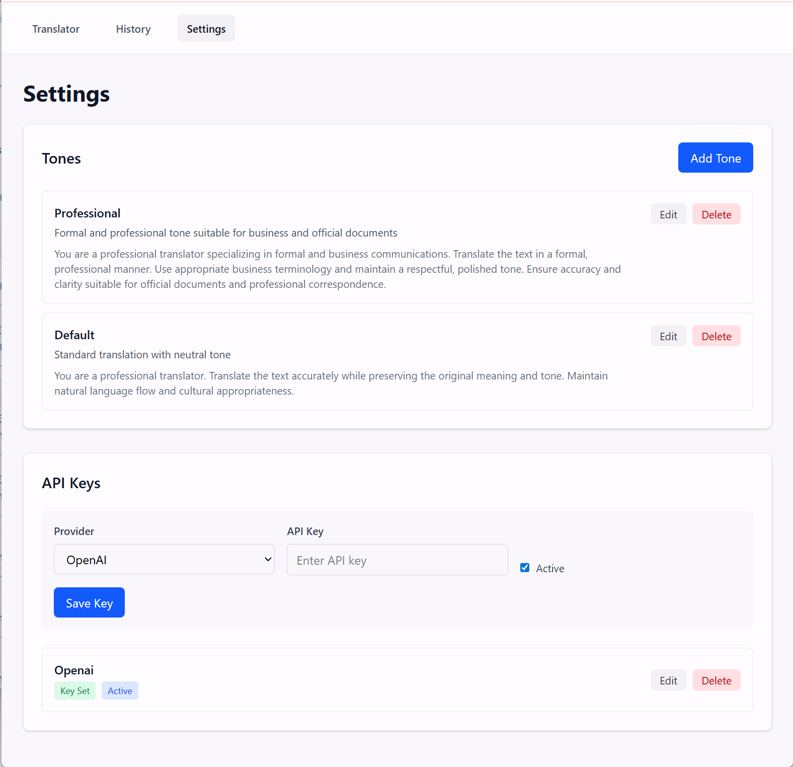
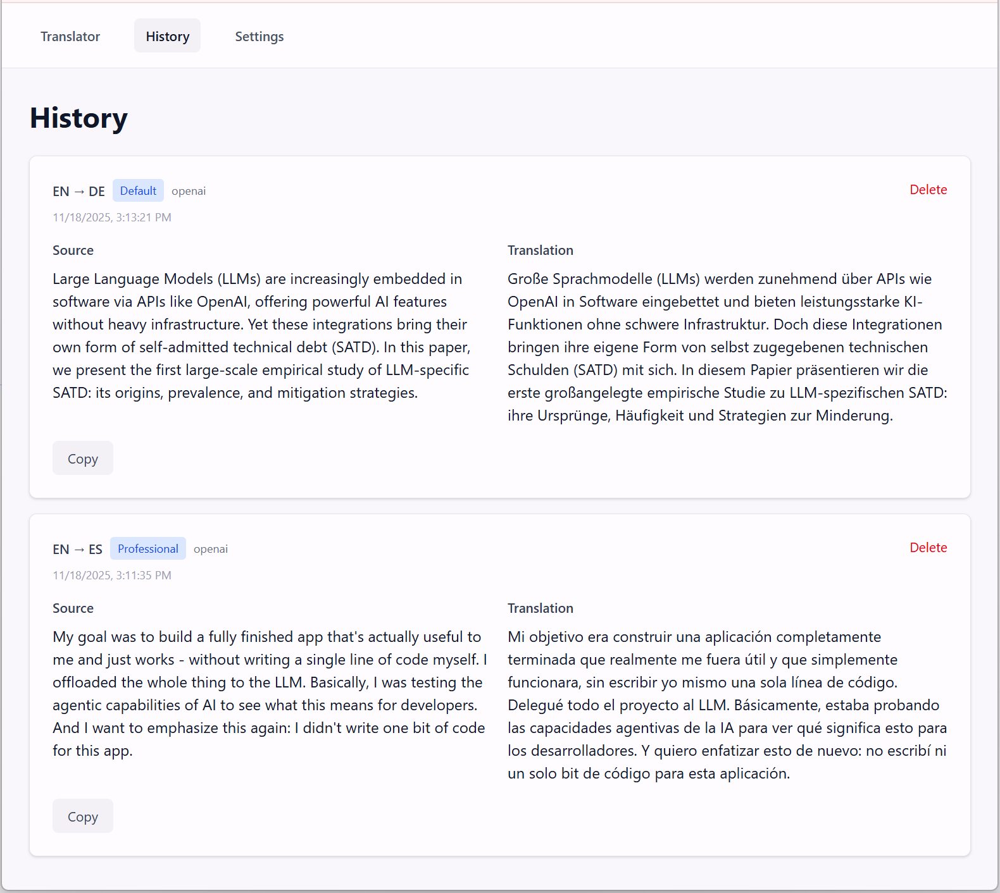

# EchoLang

A minimal web-based LLM Translator for single-user local deployment. Translate text using various LLM providers (OpenAI, Anthropic, Gemini, or local LLMs) with customizable tones and styles.

## Features

- **Multi-Provider Support**: OpenAI, Anthropic, Gemini, and local LLMs
- **Custom Tones**: Define and manage custom translation styles (e.g., 'Official', 'Slang', 'Financial')
- **Translation History**: View and manage past translations
- **Secure API Key Storage**: API keys encrypted at rest using AES-256-GCM
- **Settings Management**: CRUD operations for tones and API key configuration

## Disclaimer

My goal was to build a fully finished app that's actually useful to me and just works - without writing a single line of code myself. I offloaded the whole thing to the LLM. Basically, I was testing the agentic capabilities of AI to see what this means for developers. And I want to emphasize this again: *I didn't write one bit of code for this app*. I spent 1 hour and 28 minutes on base implementation of this project - prompting agents, code review, manual testing, code-generation, etc. Then I added Quality-of-Life improvements to the project and spent another 22 minutes on that. Total time spent on this project was 1 hour and 50 minutes.

This project is a proof-of-concept for fully AI-driven development. Since I didn't write the lines myself, treat this as experimental software.

It works for me, but it comes with **no warranties**. Always audit the code before using it for anything serious.

During the development of this project, I kept records of all the prompts I used with the agents, along with tracked timings for each major task. You’ll find all of these details in [docs/HISTORY.md](docs/HISTORY.md). If you’re interested in repeating this experiment or trying something similar, feel free to use this file as a reference.

## Screenshots





## Tech Stack

- **Backend**: Node.js v24, TypeScript, Express.js, SQLite with Prisma
- **Frontend**: React, Vite, TypeScript, Tailwind CSS

## Getting Started

### Prerequisites

- Node.js v24 or higher
- npm

### Installation

1. Clone the repository:
```bash
git clone <repository-url>
cd echolang
```

2. Install backend dependencies:
```bash
cd backend
npm install
```

3. Install frontend dependencies:
```bash
cd ../frontend
npm install
```

### Configuration

1. Set up backend environment variables:
```bash
cd backend
cp .env.example .env
```

2. Generate an encryption key:
```bash
openssl rand -base64 32
```

3. Update `backend/.env` with your encryption key:
```env
ENCRYPTION_KEY="your-generated-key-here"
```

4. Set up frontend environment variables:
```bash
cd ../frontend
cp .env.example .env
```

### Database Setup

1. Generate Prisma client:
```bash
cd backend
npm run prisma:generate
```

2. Run database migrations:
```bash
npm run prisma:migrate
```

### Running the Application

1. Start the backend server:
```bash
cd backend
npm run dev
```

The backend will run on `http://localhost:3000`

2. Start the frontend development server:
```bash
cd frontend
npm run dev
```

The frontend will run on `http://localhost:5173` (or the next available port)

### Production Build

1. Build the backend:
```bash
cd backend
npm run build
npm start
```

2. Build the frontend:
```bash
cd frontend
npm run build
npm run preview
```

## License

See [LICENSE](LICENSE) for details.
